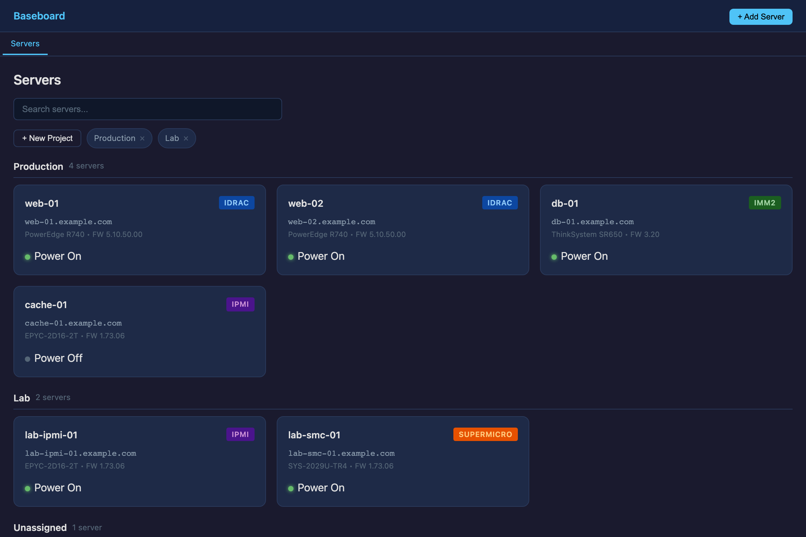
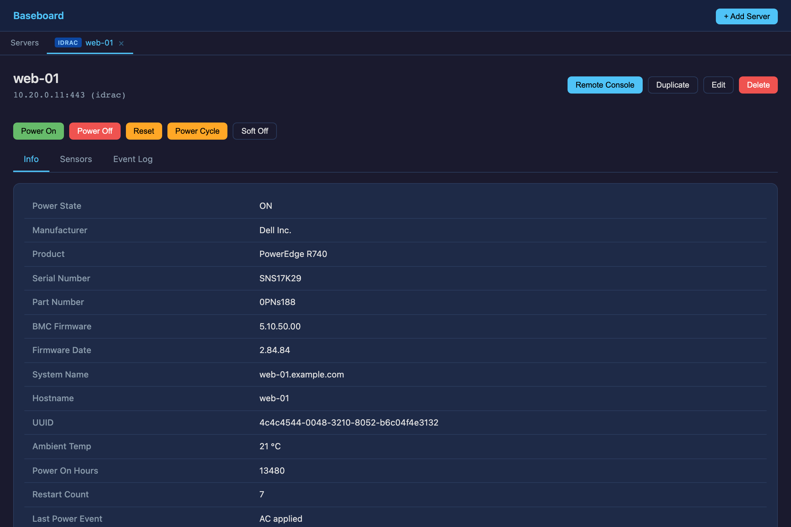
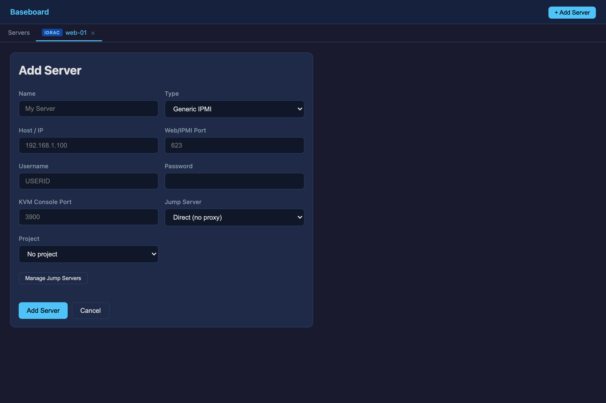

<div align="center">

# Baseboard

**A lightweight out-of-band server management console.**
Monitor sensors, read event logs, control power, and open a full KVM console on
IPMI, Lenovo IMM2, Dell iDRAC, and Supermicro BMCs — across SSH jump hosts and
isolated management networks — from one cross-platform desktop app.

[](LICENSE)




</div>

## What is this?

A server's **BMC** (baseboard management controller) is the small always-on
computer that lets you manage the machine even when its OS is down — read
temperatures and fans, inspect the hardware event log, and power-cycle it
remotely. Every vendor ships its own clunky web UI (and often a Java KVM applet)
to talk to it, and those interfaces usually live on a locked-down management
network you can only reach through a jump host.

**Baseboard** puts all of that in a single native app: add your IPMI / IMM2 /
iDRAC / Supermicro endpoints once, and get sensors, event logs, FRU inventory,
power control, and a built-in **HTML5 KVM console** — with credentials encrypted
at rest and SSH/SOCKS tunneling handled for you.

## Features

- 🖥️ **Multi-vendor** — generic IPMI 2.0 (via `ipmitool`), Supermicro, Lenovo
  IMM2, and Dell iDRAC, each through the access method it speaks natively.
- 📊 **Health at a glance** — chassis power state, sensor readings (SDR), the
  system event log (SEL), and FRU inventory, with a dashboard that polls every
  server in the background.
- 🔌 **Power control** — on, off, cycle, hard reset, and ACPI soft shutdown.
- 🎛️ **Built-in KVM console** — noVNC over a local WebSocket bridge for
  generic IPMI/Supermicro, and the vendor's native HTML5 console
  (pre-authenticated, no manual login) for IMM2/iDRAC.
- 🔐 **Out-of-band access** — reach BMCs on isolated networks through a SOCKS5
  proxy, or let Baseboard spin up an SSH-jump SOCKS tunnel automatically and
  reuse it. Jump hosts are saved and shareable across servers.
- 🔑 **Encrypted credentials** — passwords are stored with the OS keychain via
  Electron `safeStorage` (Keychain / libsecret / DPAPI), never in plaintext.
- 🗂️ **Projects & search** — group servers into projects and find them with
  fuzzy search across name, host, type, product, serial, and firmware.
- 📦 **Cross-platform** — packaged installers for Windows, macOS (Apple Silicon
  + Intel), and Linux (AppImage / deb / rpm).

## Supported hardware

| Type | Data & power | KVM console | Transport |
|------|--------------|-------------|-----------|
| **IPMI** (generic 2.0) | `ipmitool` (lanplus) | noVNC (RFB) | TCP → WebSocket bridge |
| **Supermicro** | `ipmitool` (lanplus) | noVNC (RFB) | TCP → WebSocket bridge |
| **Lenovo IMM2** | IMM2 web API | Native HTML5 console | WSS → SOCKS bridge |
| **Dell iDRAC** | web API (IMM2 path) | Native HTML5 console | WSS → SOCKS bridge |

> IMM2 has the most complete data integration; iDRAC reuses the same
> web-console path.

## Screenshots

| Server detail — power control, sensors, event log & FRU inventory | Add a server — type, credentials, SSH-jump proxy & projects |
|:---:|:---:|
| [](docs/screenshots/server-detail.png) | [](docs/screenshots/add-server.png) |

## How it works

Baseboard is a standard hardened-Electron app: a Node **main process** holds all
the privileged logic (talking to BMCs, spawning tunnels, storing secrets), a
**preload** script exposes a small typed IPC surface over `contextBridge`, and a
dependency-light **renderer** (vanilla TypeScript — custom hash router, tabs, and
DOM helpers, no framework) draws the UI.

```
┌──────────────────────────────────────────────────────────────┐
│  Renderer  (vanilla TS · router · tabs · pages)               │
│  dashboard · server detail · KVM console · forms              │
└───────────────────────────┬──────────────────────────────────┘
                            │  contextBridge — typed IPC (preload)
┌───────────────────────────▼──────────────────────────────────┐
│  Main process (Electron / Node)                               │
│   ┌──────────┬───────────────┬──────────────┬──────────────┐  │
│   │ ipmitool │ IMM2 / iDRAC  │ KVM bridges  │ SSH / SOCKS  │  │
│   │ service  │ web-API client│ (WS · TCP→WS) │ tunnels      │  │
│   └────┬─────┴───────┬───────┴──────┬───────┴──────┬───────┘  │
│   safeStorage creds · per-server JSON store · status polling  │
└────────┼─────────────┼──────────────┼──────────────┼──────────┘
         │ IPMI/LAN     │ HTTPS         │ WS / TCP      │ ssh -D
         ▼              ▼               ▼               ▼
   ┌──────────────────────────────────────────────────────────┐
   │   BMCs — reached directly or through an SSH jump host     │
   │   IPMI · Lenovo IMM2 · Dell iDRAC · Supermicro            │
   └──────────────────────────────────────────────────────────┘
```

A few details worth calling out:

- **Two console paths.** Generic IPMI/Supermicro KVM is raw RFB, so the main
  process opens a `TCP → WebSocket` bridge and renders it with a vendored
  [noVNC](https://github.com/novnc/noVNC) client. IMM2/iDRAC already speak
  WebSocket, so it bridges `WSS → SOCKS`, pre-authenticates to grab a session
  cookie, and loads the vendor's own console in a sandboxed `<webview>`.
- **Tunneling is automatic.** Point a server at a saved jump host and Baseboard
  runs `ssh -D` to create a local SOCKS proxy on demand, reuses it while it's
  alive, and tears it down on exit.
- **Concurrency-safe.** The IMM2 client caches sessions and serializes logins
  behind a lock so parallel requests don't stampede the BMC.

## Getting started

### Download

Grab the installer for your OS from the [Releases](../../releases) page (see the
install notes there). Baseboard builds are **unsigned**, so your OS will warn on
first launch — on macOS, right-click the app → **Open**.

### Requirements

Baseboard relies on two system tools being on your `PATH`:

- **`ipmitool`** — for generic IPMI and Supermicro servers
  (`apt install ipmitool` / `brew install ipmitool`).
- **`ssh`** — for the SSH-jump SOCKS tunneling (preinstalled on macOS/Linux;
  Windows ships OpenSSH as an optional feature).

IMM2 and iDRAC need neither — they're spoken over HTTPS directly.

### Build from source

```bash
git clone https://github.com/bernisnukic/baseboard.git
cd baseboard
npm install
npm run dev        # run in development
npm run package    # build an installer for your current OS → out/
```

Requires **Node.js 22 LTS**.

## Development

```
electron/            Main process (Node)
  main/              App entry + IPC handler registration
  preload/           contextBridge API exposed to the renderer
  services/          ipmitool, IMM2 web API, KVM bridges, SSH/SOCKS tunnels, store
  types/             Shared TypeScript types
src/                 Renderer (vanilla TS)
  pages/             dashboard · server detail · console · forms · jump servers
  lib/               DOM + dialog helpers
  vendor/novnc/      Vendored noVNC client (MPL-2.0)
  router.ts, tabs.ts
```

| Script | What it does |
|--------|--------------|
| `npm run dev` | Run the app with hot reload (electron-vite) |
| `npm run build` | Type-check + bundle main/preload/renderer to `dist/` |
| `npm run package` | Build installers for the current OS |
| `npm run package:mac` / `:win` / `:linux` | Build for a specific OS |

**Stack:** Electron 34 · TypeScript · electron-vite (Rollup) · `ws` · `socks` ·
vendored noVNC. No UI framework.

## Building & releases

Installers are produced by [electron-builder](https://www.electron.build/) and
built in CI on native runners — there's no reliable way to cross-compile a
signed/native app for every OS from one machine:

| OS | Output |
|----|--------|
| macOS | `.dmg` for Apple Silicon **and** Intel (ad-hoc signed) |
| Windows | NSIS `.exe` installer |
| Linux | `.AppImage`, `.deb`, `.rpm` |

Pushing a `v*` tag runs `.github/workflows/release.yml`: it builds on
macOS/Windows/Linux in parallel, then publishes the artifacts to a GitHub
Release with install instructions. You can also trigger the workflow manually
(`workflow_dispatch`) to get build artifacts without cutting a release.

```bash
npm version patch        # bump version + create the tag
git push --follow-tags   # CI builds all three platforms and publishes
```

## Security notes

- **Self-signed certificates are accepted.** BMCs almost universally ship
  self-signed TLS certs, so Baseboard accepts them for management traffic. This
  is a deliberate trade-off for trusted management networks, not general-purpose
  browsing.
- **Bridges bind to `127.0.0.1` only** — the local WebSocket/TCP bridges that
  feed the KVM console are never exposed off the machine.
- **Credentials** are encrypted with the OS keychain (`safeStorage`); when the
  platform can't provide encryption, the fallback is base64-encoded on disk
  (documented in `server-store.ts`, not treated as secure).
- Standard Electron hardening is on: context isolation, no node integration in
  the renderer, a tight preload bridge, and a Content-Security-Policy.

## Acknowledgements

- [noVNC](https://github.com/novnc/noVNC) — HTML5 VNC client, vendored under
  `src/vendor/novnc/` (MPL-2.0, see its `LICENSE.txt`).
- [`ipmitool`](https://github.com/ipmitool/ipmitool), and the
  [`ws`](https://github.com/websockets/ws) and
  [`socks`](https://github.com/JoshGlazebrook/socks) libraries.

## License

[MIT](LICENSE) © 2026 Bernis Nukić
